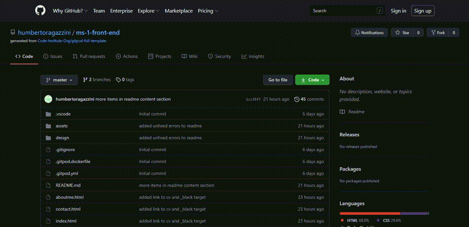

# My Resume Milestone Project 1 - Humberto Ragazzini

welcome to ‘’my resume’’, this website was designed with the purpose of establishing contact with those entities that are interested in my profile in an organized, efficient and simple way. either for a job opportunity or for a particular project.
For this reason, I have added a section to the website page where you can complete a simple form to contact me.

In order to access the website and visit it, you can do it by the following GitHub link: [My Resume Project](https://humbertoragazzini.github.io/ms-1-front-end/)

# **UX**

## **Strategy**


### I divided the strategy into simple points that I am going to name below:

* **My idea**: is create a website where that person or company who is looking for a Web developer can access to my information in a simple way.

* **Show Skill in The First Visit**: : Entering the site for the first time, I would like the user to be able to verify my completed skills without having to explicitly name them.

* **My goal**: Easy way to see what my skills are, what type and style of programmer I am. You can download my CV, if necessary, but mainly you will have an overview of me as a web developer, in this way you will be given useful information in case you want to contact me or not.

* **Users Goal**: To be able to see what my skills are, what kind or style of web programmer I am, download my CV if he needs it, but mainly to be able to have an overview of me as a web developer and in this way be able to make the decision to contact me or not.

## **Scope**

*	In my ''strategy'' one of the main points is to show you with the first visit my capacities, in a fast and organized way, the following features are limited to my knowledge:

* **The main feactures**: the possibility of navigating between the following options to find quick as possible the information needed:
    * An overview where you can see my main data (personal info) and general skills.
    * A summary about the places I have worked and studied.
    * A list in more detail my skills and the progress of each of them.
    * A way to contact me for inquiries or job opportunities.

* **Full mobile device compatibility**: The inclusion of being able to navigate the site from any device, including access from a mobile.

* **Tiles**: Efficient and orderly presentation of the information, inclusion of tiles, where each one has a role on the page.

* **Desired functions for the future**: 
    * A section with the portfolio of all the projects where I play a role.
    * Add the possibility of receiving all the contact request to a WhatsApp account (for quicker respond)
    * Implement multi-language options
    * Execute High Contrast theme, and Dark theme in the web site.
    * A data base with all the contacts with the possibility to filter and organize by type (remote or not), place (can be by country, state or city), time (when the contact take place), and the subject or reason (project or job).


## **Structure**

In this section the basic structure will be outlined, and how the information will be presented.

*	**What a guest would like to see the first time:**
    * Who I am
    * Personal details
    * Skills
    * How to contact me


*	**How I present this information: The best way for me to present the info is through groups.**
    * The main group will be our tabs, home, my story, about me and contact.
    * The secondary group will be the tiles (squares with information in it), these tiles will show more specific information about, skills, activities, studies.
    * **Home:**
        * Personal information: Here will be showing thing such like Full Name, Phone, Email and a profile picture.
        * Core Competences: This tile is a group of core competences like team working, learning and adaptability, problem solving.
        * Recent Activities: This tile will be a list of the latest activities, such a study, progress of a project, new acquired skills, etc.
    * **My Story:**
        * My work history: Basically, is a timeline of the different jobs ordered by date.
        * My Study history: Like the work history this will be a timeline with every single study done by dates.
    * **About Me:**
        * Coding Skills: Inside of this tile are the different coding skills with the level of each one by percentage.
        * Other Skills: Although this is a web developer resume, in this tile is for other skills which are not directly connected with a web developer job but can be helpful.
    * **Contact:**
        * Contact form: A contact form with basic information such a name, email, and a text area to write the job opportunity or project in mind.

        


## **Skeleton**

In this part of the project, I start building wireframes in balsamic of the structure to see how this menus and tiles (squares with more specific information) looks like.

This is a direct link to try the wireframes, also below this link you can find images of every single wireframe made for this project:

_Live Wireframes to try:_
[Try Me](https://balsamiq.cloud/shar9rt/pap1kxl/r2278?f=N4IgUiBcCMA0IDkpxAYWfAMhkAhHAsjgFo4DSUA2gLoC%2BQA%3D)

_Links of all the individual wireframes:_

Home page:
- [Home Desktop View](design/wireframes/home-view/home-desktop-view.png)
- [Home Mobile View](design/wireframes/home-view/home-mobile-view.png)
- [Home Tablet Landscape View](design/wireframes/home-view/home-tablet-landscape-view.png)
- [Home Tablet Portrait View](design/wireframes/home-view/home-tablet-portrait-view.png)

My Story page:
- [My Story Desktop View](design/wireframes/my-story-view/my-story-desktop-view.png)
- [My Story Mobile View](design/wireframes/my-story-view/my-story-mobile-view.png)
- [My Story Tablet Landscape View](design/wireframes/my-story-view/my-story-tablet-landscape-view.png)
- [My Story Tablet Portrait View](design/wireframes/my-story-view/my-story-tablet-portrait-view.png)

About Me page:
- [About Me Desktop View](design/wireframes/about-me-view/about-me-desktop-view.png)
- [About Me Mobile View](design/wireframes/about-me-view/about-me-mobile-view.png)
- [About Me Tablet Landscape View](design/wireframes/about-me-view/about-me-tablet-landscape-view.png)
- [About Me Tablet Portrait View](design/wireframes/about-me-view/about-me-tablet-portrait-view.png)

Contact page:
- [Contact Desktop View](design/wireframes/contact-view/contact-desktop-view.png)
- [Contact Mobile View](design/wireframes/contact-view/contact-mobile-view.png)
- [Contact Tablet Landscape View](design/wireframes/contact-view/contact-tablet-landscape-view.png)
- [Contact Tablet Portrait View](design/wireframes/contact-view/contact-tablet-portrait-view.png)

## **Surface**

In this section all the html and CSS coding start, in the skeleton surface I try some color taken from [coolors](https://www.coolors.co), this site was provided by my mentor.

The information is the most important item on the website, for this reason a chose some flat colors, no to bright and no to opaque.

Before start coding the index, I did a research about what are the most common mobile and pc resolution around the world.

The most common mobile resolution is:

Resolution | Mobile percentage
------------ | -------------
360x640  | 10.77%
414x896 | 7.37%
360x780 | 5.9%
375x667 | 5.56%
360x800 | 5.52% 
360x760 | 5.15% 

Data taken from _[statcounter](https://gs.statcounter.com/screen-resolution-stats/mobile/worldwide)_

For this reason i get to the body a minimum width of 360px to ajust to the bast majority of them.

For desktop screen resolution the numbers are different

Resolution | Desktop porcentage
------------ | -------------
1920x1080  | 20.99%
1366x768 | 20.23%
1536x864 | 9.72%
1440x900 | 6.23%
1280x720 | 5.45%
1600x900 | 3.47%

Between the 1080px and 768px resolution we have almost the 50% of the users, if we add 768px, 864px and 900p we have more than 60% of the users.

In this case basically I adjust the desktop target resolution to 768px and a width max limit of 1200px and a body max limit to 1080px.


### *Navbar**

The navbar is made for 4 main buttons, Home, My Story, About ME, Contact, each of these buttons show a line under beneath when you are in that section. If the button is hover by the mouse it became in a different color to denotate that you are going to go that section.


### **Middle Section**

- In the middle section we can see between 1 to 3 main tiles (squares) the column (Recent activities) is presented in every single section (the contact section is the only one without this column). This column will show all the recent activities such a project, jobs.
- In the Story section we have 2 main tails, one with all the jobs by dates simple to read. Below we have the studies history line, both are full responsive, and change from horizontal layout (desktop or resolution wider than 500px) to vertical layout.
- Inside of about my, we can check all the skills, coding skills and other skills, every skill have his own progress bar.
- The contact section has a contact form which is not working (at the moment do not send the request to an email).
- Image of the completed web site:
    
    
    

### **The footer**

The footer its full responsive to, and have links to different parts of the site, and a download CV link, just in case someone need a more traditional cv format. The social column has links to the different social media websites.


# **Testing**

## **Responsive**
    
The site it has made to be responsive between 360p to up to 1200px:
    
* Image of the mobile web site: 
   
   
    
    
* Image to show the responsive design in the web site: 
   
   
    

## **Validators**

* I did the validation for every single page, this are the result:
    - Index validation: 
    
    


    - My Story validation:
    
    


    - About Me validation:
    
    


    - Contact validation:
    
    


* CSS validation

    -Css validation result:

    

## **Testing Web Site**

* Home Page:
    - Tested:
        1) Navbar ( all links: home, my story,about me, contact )
            - bug ( button was far to the right / fixed by css position )
                ```CSS
                    #menu-buttom{
                    float: right;
                    right: 40px;
                    }
                ```
            - bug ( bug in firefox navbar items without divs looks displaced to the top / fixed wrapping i and p element inside of a div)
                ```HTML
                    <ul class="ul-nav-bar">
                        <li>
                            <a href="index.html">
                                <div>
                                    <i class="fas fa-home icon-center icon-font"></i>
                                    <p class="nav-bar-titles uppercase active-element-navbar">home</p>
                                </div>
                            </a>
                        </li>
                        <li class="vertical-line">
                            <a href="mystory.html">
                                <div>  
                                    <i class="fas fa-landmark icon-center icon-font"></i>
                                    <p class="nav-bar-titles uppercase">my story</p>
                                </div>
                            </a>
                        </li>
                        <li class="vertical-line">
                            <a href="aboutme.html">
                                <div>
                                    <i class="fas fa-male icon-center icon-font"></i>
                                    <p class="nav-bar-titles uppercase">about me</p>
                                </div>
                            </a>
                        </li>
                        <li class="vertical-line">
                            <a href="contact.html">
                                <div>
                                    <i class="fas fa-comments icon-center icon-font"></i>
                                    <p class="nav-bar-titles uppercase">contact</p>
                                </div>
                            </a>
                        </li>
                    </ul>
                ```
                - bug ( bug in safari/chrome/firefox navbar looks to the right side, fixed added class line-div-vertical in divs / removed vertical-line from il)
                ```HTML
                    <ul class="ul-nav-bar">
                        <li>
                            <a href="index.html">
                                <div>
                                    <i class="fas fa-home icon-center icon-font"></i>
                                    <p class="nav-bar-titles uppercase active-element-navbar">home</p>
                                </div>
                            </a>
                        </li>
                        <li>
                            <a href="mystory.html">
                                <div class="line-div-vertical">  
                                    <i class="fas fa-landmark icon-center icon-font"></i>
                                    <p class="nav-bar-titles uppercase">my story</p>
                                </div>
                            </a>
                        </li>
                        <li>
                            <a href="aboutme.html">
                                <div class="line-div-vertical">
                                    <i class="fas fa-male icon-center icon-font"></i>
                                    <p class="nav-bar-titles uppercase">about me</p>
                                </div>
                            </a>
                        </li>
                        <li>
                            <a href="contact.html">
                                <div class="line-div-vertical">
                                    <i class="fas fa-comments icon-center icon-font"></i>
                                    <p class="nav-bar-titles uppercase">contact</p>
                                </div>
                            </a>
                        </li>
                    </ul>
                ```
                Css rules added
                ```CSS
                    .line-div-vertical{
                        border-left: solid 2px black;
                    }
                    .ul-nav-bar div{
                        width: 160px;
                        padding: 5px 25px;
                    }
                ```                
        2) Profile Image: position, size, all correct from 360px to 1200px
        3) personal info: position, size, style, all correct from 360px to 1200px
        4) my core competences: position, size, style, style, all correct from 360px to 1200px
        5) footer: 
            - links: 
            - Bug (social links do not work)
            - code (Added "https://" to all links and target="_blank"), icons, social and download cv, style, all correct from 360px to 1200px
                ```Fix
                    <ul class="footer-layout-transformation social-footer">
                        <li>
                            <a href="https://www.facebook.com" target="_blank">
                                <i class="fab fa-facebook-square"></i>
                                <span>facebook</span>
                            </a>
                        </li>
                        <li>
                            <a href="https://www.instagram.com" target="_blank">
                                <i class="fab fa-instagram-square"></i>
                                <span>instagram</span>
                            </a>
                        </li>
                        <li>
                            <a href="https://www.twitter.com" target="_blank">
                                <i class="fab fa-twitter-square"></i>
                                <span>twitter</span>
                            </a>
                        </li>
                        <li>
                            <a href="https://www.youtube.com" target="_blank">
                                <i class="fab fa-youtube-square"></i>
                                <span>youtube</span>
                            </a>
                        </li>
                    </ul>
                ```
* My Story:
    - Tested:
        1) Navbar ( all links: home, my story,about me, contact).
            * _The navbar mobile was affected for the same bug than home page._
            * _The navbar items was affected for the same bug than home page._
        2) My Story: position, size, all correct from 360px to 1200px.
        3) My History Work line: position, size, style, all correct from 360px to 1200px.
        4) My History Studies line: position, size, style, style, all correct from 360px to 1200px.
        5) footer: links, icons, social and download cv, style, all correct from 360px to 1200px.
            * _The links and social here was affected for the same bug than home page._

* About Me:
    - Tested:
        1) Navbar ( all links: home, my story,about me, contact).
            * _The navbar mobile was affected for the same bug than home page._
            * _The navbar items was affected for the same bug than home page._
        2) Coding Skills: position, size, all correct from 360px to 1200px.
        3) Other Skills: position, size, style, all correct from 360px to 1200px.
        - footer: links, icons, social and download cv, style, all correct from 360px to 1200px.
            * _The links and social here was affected for the same bug than home page._
            
* Contact:
    - Tested:
        1) Navbar ( all links: home, my story,about me, contact )
            * _The navbar mobile was affected for the same bug than home page._
            * _The navbar items was affected for the same bug than home page._
        2) Contac Form: position, size, all correct from 360px to 1200px.
        3) Modal (request sent): position, size, style, all correct from 360px to 1200px.
        - footer: links, icons, social and download cv, style, all correct from 360px to 1200px.
            * _The links and social here was affected for the same bug than home page._

## **Unfixed Bugs**

* I did not find any errors, the website was tested on the following devices:
    - Samsung s9+ (Android) Ver. 
        - Web Browsers: 
            - EDGE: Versión 91.0.864.37
            - Chrome: Versión 90.0.4430.212
            - Mozilla: 88.0.1 (64-bit)
            - Opera: Opera 75 Release date	2021-03-24
    - Iphone 12 Pro (IOS) ver.14.6
        - Web Browsers: 
            - Zafari: ver. 14
    - Galaxy Tab S4 (Android) Ver.10 - 4.4.205-19646842
        - Web Browsers: 
            - EDGE: ver.46.04.4.5157
            - Chrome: ver.91.0.4472.77
            - Mozilla: ver.88.1.3
            - Opera: ver.63.3.3116.58675
    - Pc (windows 10) Ver.20H2 - 19042.985
        - Web Browsers: 
            - EDGE: Versión 91.0.864.37
            - Chrome: Versión 90.0.4430.212
            - Mozilla: 88.0.1 (64-bit)
            - Opera: Opera 75 Release date	2021-03-24
    - PC (Linux Ubuntu) Ver. 
        - Web Browsers: 
            - Mozilla:  


# **Frameworks and Tecnologies**

- HTML5

- CSS

- BOOTSTRAP 5 - _[bootstrap](https://getbootstrap.com/)_.

- GITPOD - _[gimp photo editor](https://imagen.online-convert.com/es/convertir/mp4-a-gif)_.

- GITHUB - _[github](https://github.com/)_.

- W3C VALIDATOR - Validator html and css: _[w3c validator](https://validator.w3.org/)_.

- GIMP - GIMP photo editor: _[gimp photo editor](https://www.gimp.org/)_.

- ACTION SCREEN RECORDER - Screen recorder: _[ACTION](https://mirillis.com/es/productos/action-grabacion-de-pantalla-y-videojuegos.html)_. 

- Resolve Video Editor - _[Resolve](https://www.blackmagicdesign.com/products/davinciresolve/)_.

- ONLINE-CONVERTER - Video to gif: _[Online converter](https://imagen.online-convert.com/es/convertir/mp4-a-gif)_.

- GOOGLE FONT - Google fonts: _[google font](https://fonts.google.com/)_.


# **Deployment**

## To deploy my project:

1) Go to my github main page and login in.

2) Select the repository, in this case :[Git Hub Repository](https://github.com/humbertoragazzini/ms-1-front-end).
    
3) In this tab select settings.
    
4) Click in pages in the option menu.
    
5) Select in source branch master.
    
6) Save, the project is deployed in github pages in the following link:[Project-My-Resume](https://humbertoragazzini.github.io/ms-1-front-end/)


## **To clone my repository in github**

To clone de repository follow this steps:

1)
    1.a) In my repository you can click in download.

    1.b) Safe the file an after that uncompressed the file in you desired directory.

    1.c) Now you can open the project with any IDE.



2)
    2.a) First of all we need to install git from this link [GitBash](https://git-scm.com/downloads) .

    2.b) After install gitbash in the command prompt select the path where you prefer to save the files.

    2.c) Execute the command in gitbash:
    ```git clone https://github.com/humbertoragazzini/ms-1-front-end.git ```

    2.d) After this you now can open the project with any ide such a Visual Studio.


# **Credits**


## **Content**

**The text:**
- I have written all the web site text, my mentor detected some spelling problems, my wife helped me to fixed them. (Thanks to Yamile Simes)

**The form:** 
- part of the code was utilized from the official bootstrap website and the code institute learning page
_[bootstrap form address](https://getbootstrap.com/docs/5.0/forms/overview/)_.

**The icons:** 
- the icons were used from the font awesome website; The link was provided by the code institute learning page
_[font awesome web site](https://fontawesome.com/)_.

**The fonts:**  
- From google fonts, The link was provided by the code institute learning page

**Navmenu (desktop):**
- I used it from code institute learning videos, and make some modifications

**Navmenu (mobile):** 
- Utilized it from bootstrap dropdown and navbar menus.
_[navbar bootstrap](https://getbootstrap.com/docs/5.0/components/navbar/)_ / 
_[dropdown menu bootstrap](https://getbootstrap.com/docs/5.0/components/dropdowns/)_.

**Progress bars:** 
- From bootstrap web page in the progress bar section
_[progress bars bootstrap](https://getbootstrap.com/docs/5.0/components/progress/)_.

## **Media**

**Background**: made with GIMP on windows.

**Logos**: taken from: 
- Jazztel Telecomunication: _[Jazztel](https://www.jazztel.com/)_  
- HDC Computers: _[HDC](https://www.paseolugones.com.ar/marca/hdc/)_ 
- Morrisons: _[Morrisons](https://groceries.morrisons.com/webshop/startWebshop.do)_  
- Cisco CCNA: _[Cisco](https://www.cisco.com/)_  
- Secondary School Sarmiento: _[Sarmiento](https://www.facebook.com/IDFSarmiento/)_  
- UTN University: _[UTN](https://www.frc.utn.edu.ar/)_ 

**Colors**: 
- the colors of the entirely website was taken from _[coolors](https://www.coolors.co)_.
- Thanks to my mentor for provide me with this link.

**Videos**: 
- Edited with Resolve. 
- Recorded with Action.

**Gif**
- Edited and Converted with onlineconverter _[online converter](https://www.onlineconverter.com/)_.


