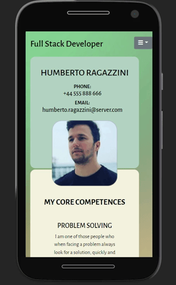

# My Resume Milestone Project 1 - Humberto Ragazzini

Welcome to "my resume", this website was designed with the purpose of being able to communicate to people who are interested in hiring me, either for a particular project or to work as a full-time employee, for this reason I was added to the website a page where you can fill in a very simple form to be able to contact me.

In order to access the website and visit it, you can do it by the following github link: [My Resume Project](https://humbertoragazzini.github.io/ms-1-front-end/)

# **UX**

## **Strategy**

### I divided the strategy into simple points that I am going to name below:

* **My idea**: A website where that person or company who is looking for a web developer can find my information in a simple and organized way.

* **Show Skill in The First Visit**: I would like that when entering for the first time, that person or company is able to see my skills as a web programmer or as a person, without having to name them explicitly.

* **My goal**: Taking aside the obviousness of finding a company or a person who needs my services, the main goal of my website is to be able to provide that person not only with a view of my skills, my work history or studies, but also They can see what the projects I did, what I am doing, or what I am going to do in the future.

* **Users Goal**: To be able to see what my skills are, what kind or style of web programmer I am, download my CV if he needs it, but mainly to be able to have an overview of me as a web developer and in this way be able to make the decision to contact me or not.

## **Scope**

In my strategy one of the points was to show with the first visit that I am capable as a web developer, and that access to information is fast and organized, the following feactures that are limited to my knowledge:

* **The main feactures**: the possibility of navigating between the following options to find as quick as possible the information needed:
    * An overview where you can see my main data (personal information) and the more general skills
    * A summary about the places where I work as well as where I studied)
    * A list in more detail my skills and the progress of each of them
    * A way to contact me either for a project or for a job opportunity

* **Full mobile device compatibility**: The inclusion of being able to navigate the site from any device, and that accessing from a mobile is not a limitation

* **Tiles**: for the presentation of more organized information the inclusion of tiles, where each one will have a role within the page.

* **Desired functions for the future**: 
    * A section with the portfolio of all the projects where I play a role.
    * Add the possibility to recive all the contact request to a whatsapp account (for quicker respond)
    * Implement multi-language options
    * Implement High Contrast theme, and Dark theme in the web site.
    * A data base with all the contacts with the possibility to filter and organize by type (remote or not), place (can be by country, state or city), time(when the contact take place), Why (a project, job).

## **Structure**

In this section I am going to outline the basic structure, and how I am going to present all the information.

* **What a visiter would like to see the first time**:
    * How i am? 
    * Personal details
    * skills
    * How to contact me?

* **How i present this information**: I thought that the best way to present all this information is in groups.
    * The main group will be our tabs, home, my story, about me and contact.
    * The secundary group will be the tiles (squares with information in it), this tiles will show more specific information about, skills, activities, studies.
        * **Home**:
            * _Personal information_: Here will be showing thing such like Full Name, Phone, Email and a profile picture.
            * _Core Competences_: This tile is a group of core competences like team working, learning and adaptability, problem solving.
            * _Recent Activities_: This tile will be a list of the lastest activities, such a studies, progress of a project, new adquired skills, etc.
        * **My Story**:
            * _My work history_: Basically its a time line of the different jobs ordered by date
            * _My Studie history_: Like the work history this will be a time line with every single studie done by dates.
        * **About Me**:
            * _Coding Skills_: Inside of this tile are the different coding skills with the level of each one by porcentage.
            * _Others Skills_:  Although this is a webdeveloper resume, in this tile is for others skills which are not directly connected with a web developer job, but can be helpful.
        * **Contact**
            * _Contact form_ : A contact form with basic information such a name, email, and a text area to write the job oportunity or project in mind.

        

## **Skeleton**

In this part of the project i start building wireframes in balsamic of the structure to see how this menus and tiles (squares with more specific information) looks like.

This is a direct link to try the wireframes, also below this link you can find images of every single wireframe made for this project:

_Live Wireframes to try:_
[Try Me](https://balsamiq.cloud/shar9rt/pap1kxl/r2278?f=N4IgUiBcCMA0IDkpxAYWfAMhkAhHAsjgFo4DSUA2gLoC%2BQA%3D)

_Links of all the individual wireframes:_

Home page:
- [Home Desktop View](design/wireframes/home-view/home-desktop-view.png)
- [Home Mobile View](design/wireframes/home-view/home-mobile-view.png)
- [Home Tablet Landscape View](design/wireframes/home-view/home-tablet-landscape-view.png)
- [Home Tablet Portrait View](design/wireframes/home-view/home-tablet-portrait-view.png)

My Story page:
- [My Story Desktop View](design/wireframes/my-story-view/my-story-desktop-view.png)
- [My Story Mobile View](design/wireframes/my-story-view/my-story-mobile-view.png)
- [My Story Tablet Landscape View](design/wireframes/my-story-view/my-story-tablet-landscape-view.png)
- [My Story Tablet Portrait View](design/wireframes/my-story-view/my-story-tablet-portrait-view.png)

About Me page:
- [About Me Desktop View](design/wireframes/about-me-view/about-me-desktop-view.png)
- [About Me Mobile View](design/wireframes/about-me-view/about-me-mobile-view.png)
- [About Me Tablet Landscape View](design/wireframes/about-me-view/about-me-tablet-landscape-view.png)
- [About Me Tablet Portrait View](design/wireframes/about-me-view/about-me-tablet-portrait-view.png)

Contact page:
- [Contact Desktop View](design/wireframes/contact-view/contact-desktop-view.png)
- [Contact Mobile View](design/wireframes/contact-view/contact-mobile-view.png)
- [Contact Tablet Landscape View](design/wireframes/contact-view/contact-tablet-landscape-view.png)
- [Contact Tablet Portrait View](design/wireframes/contact-view/contact-tablet-portrait-view.png)

## **Surface**

In this section all the html and css coding start, in the skeleton surfave i try some color taken from [coolors](https://www.coolors.co), this site was provided by my mentor.

The information is the most important item in this website, for this reason a chose some flat colors, no to bright and no to opaque.

Before starting coding the index, I did a research about what are the most commond mobile and pc resolution around the world.

The most commond mobile resolution are:

Resolution | Mobile porcentage
------------ | -------------
360x640  | 10.77%
414x896 | 7.37%
360x780 | 5.9%
375x667 | 5.56%
360x800 | 5.52% 
360x760 | 5.15% 

Data taken from _[statcounter](https://gs.statcounter.com/screen-resolution-stats/mobile/worldwide)_

For this reason i get to the body a minimum width of 360px to ajust to the bast majority of them.

For desktop screen resolution the numbers are different

Resolution | Desktop porcentage
------------ | -------------
1920x1080  | 20.99%
1366x768 | 20.23%
1536x864 | 9.72%
1440x900 | 6.23%
1280x720 | 5.45%
1600x900 | 3.47%

Between the 1080p and 768p resolution we have almost the 50% of the users, if we add 768p, 864p and 900p we have more than 60% of the users.

In this case basically I adjust the desktop target resolution to 768p and a width max limit of 1200p and a body max limit to 1080p.

### *Navbar**

The navbar is made for 4 main buttons, Home, My Story, About ME, Contact, each of this buttons show a line under beneath whe you are in that particular seccion.
If the button is hover by the mouse its became in a different color to denotate that you are going to go that seccion.

### **Middle Section**

- In the middle seccion we can see betwen 1 to 3 main tiles (squares) the column (Recent activities) is presented in every single seccion (the contact seccion its the only one without this column).
This column will show all the recent activities such a project, jobs.
- In the Story seccion we have 2 main tails, one with all the jobs by dates simple to read. Below we have the studies history line, both are full responsive, and change from horizontal layout (desktop or resolution wider than 500px) to vertical layout.
- Inside of about my, we can check all the skills, coding skills and other skills, every skill have his own porogress bar.
- The contact seccion have a contact form which is not working at the moument (do not send the request to a email)
- Image of the completed web site:
    
    
    

### **The footer**

The footer its full responsive to, and have links to diferent parts of the site, and a download CV link, just in case some one need a more traditional cv format.
The social column have links to the diferent social media websites.

## **Testing**

### **Responsive**
    
The site its made to be responsive between 360p to upto 1200px:
    
* Image of the mobile web site: 
   
   
    
    
* Image to show the responsive design in the web site: 
   
   
    

### **Validators**

* I did the validation for every single page, this are the result:
    - Index validation: 
    
    

    - My Story validation:
    
    

    - About Me validation:
    
    

    - Contact validation:
    
    

* CSS validation

    -Css validation result:

    

### **Unfixed Bugs**

* I did not find any errors, the website was tested on the following devices::
    - Samsung s9+ (Android) Ver. 
        - Web Browsers: EDGE, Chrome, Mozilla, Opera.
    - Iphone 12 Pro (IOS) ver.
        - Web Browsers: Zafari.
    - Galaxy Tab S4 (Android) Ver.
        - Web Browsers: EDGE, Chrome, Mozilla, Opera.
    - Pc (windows 10) Ver.
        - Web Browsers: EDGE, Chrome, Mozilla.
    - PC (Linux Ubuntu) Ver.
        - Web Browsers: Mozilla. 

## Deployment

### The site was deployed to GitHub pages. The steps to deploy are as follows:

## Credits

### Content

**The text**: 
- I write all the text in the web site

**The form**: 
- part of the code was taken from the oficcial bootstrap website and from the code institute learning page.

**The icons**: 
- the icon are from font awsome, and this link was provided by the learning page in code institute.

**The fonts**: 
- from google fonts, this link is from learning page in code institute.

**Navmenu**: 
- I take this from code institute learning videos, and make some modifications.

**Progress bars**:
- From bootstrap web page in the progress bar section.

### Media

**Background**: made with GIMP on windows.
- GIMP photo editor: _[gimp photo editor](https://www.gimp.org/)_.

**Colors**: 
- the colors of the enterely website was taken from [coolors](https://www.coolors.co).
- Thanks to my mentor for provide me with this link.

